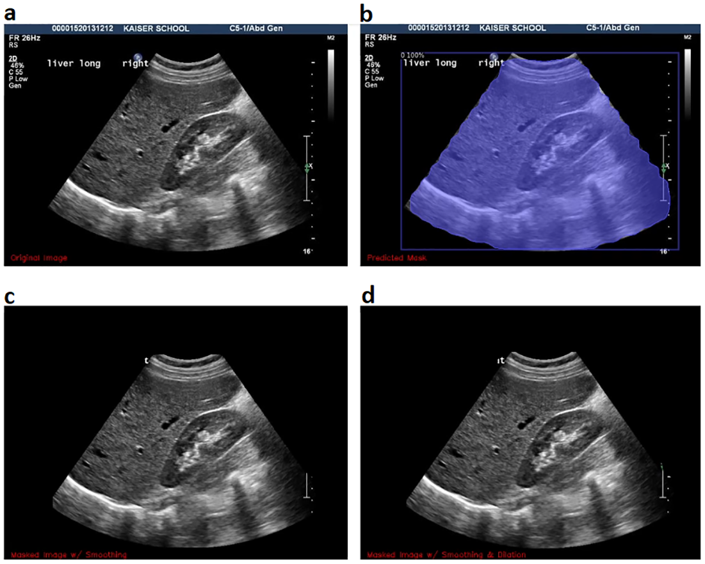

# Cone segmentation

The Cone Segmentation module segments the cone from ultrasound medical images taking out all the artifacts the machine creates around (text, patient's data, date of measurement, cardiac cycle signal) that tending to affect the chamber segmentation in automatic methods. This module also reduces the human effort of manually cutting out the cone.

The method: 
*  Uses [Detectron2](https://ai.meta.com/tools/detectron2/).
*  Was trained with varying epochs (since 100 until 1500 epochs).
*  A five k-fold cross-validation is used to evaluate and determine the optimal choice.
*  Can deal with any input (.jpg, .png, .avi, DICOM files, etc.).

