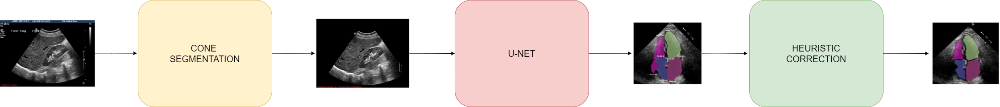

# SYSCARDIO

Thi is the SYSCARDIO system, used in the article [Robust cardiac segmentation corrected with heuristics](https://journals.plos.org/plosone/article?id=10.1371/journal.pone.0293560) and features three blocks:

* Cone segmentation.
* U-Net for cardiac chambers segmentation in 4-CH images.
* Heuristic correction for correct chambers overlapping.

All three blocks works in a secuencial way (as it shown in the follow figure).

Alan Cervantes Guzman  
[LAPI, UNAM](https://lapi.fi-p.unam.mx/)
