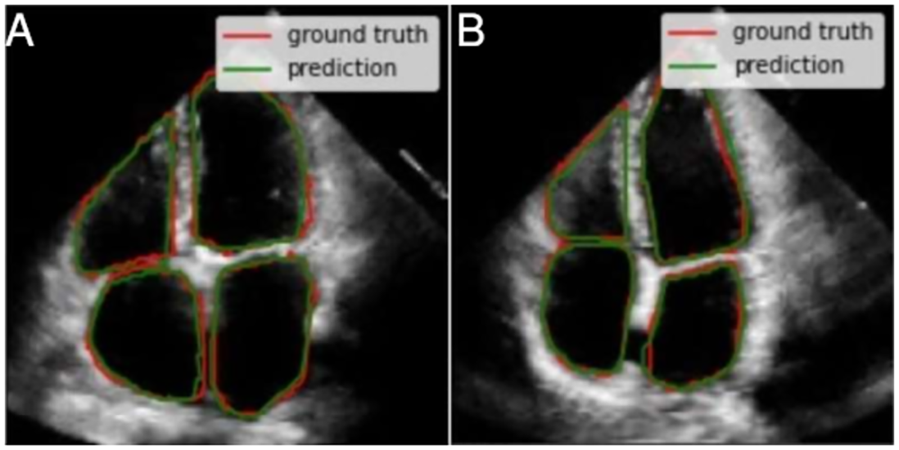

# U-NET

This UNET module from SYSCARDIO project segments the 4-CH and used a training dataset of 418 images taken from [EchoNet-Dynamic Cardiac Ultrasound](https://aimi.stanford.edu/echonet-dynamic-cardiac-ultrasound) and a testing dataset of 218 images.

## Important

- The module needs a stack type image volume in .tif file format in the next directory: /dataset/real_data. If you need to test the model with different real data keep that on mind! 

You will find the results of your testings in the next directory: /results. The testing code generates:
- The masks.
- Contours above their respective image (an example shown at end of this README).
- json files with the coordenates from each cardiac cavity from each image.

## Some pre-training parameters:
- Normalization in image pixel values.
- Shuffling.
- Resize to (128 x 128).
- Training set batch size: 8
- Validation set batch size: 4

## Training parameters:
- Learning rate: 1e-3.
- Epochs: 50
- Adam optimizer.
- Cross entropy loss function

## Metrics:
- Dice Coefficient
- Pixel Accuracy
- Intersection over Union

## Training results
- Approximate training time: 1163.5 sec
- Dice-Score: 0.92
- IoU Score: 0.85
- Pixel Accuracy Score: 0.94

## Approximate inference time: 13.3 sec

## Results using a HP 255 G8 Notebook with:
- AMD Ryzen 5 5500U (12 CPUs) (2.1 GHz)
- AMD Radeon Graphics
- RAM: 16 GB
- VRAM: 512 MB
- Shared screen memory: 7.7 GB

